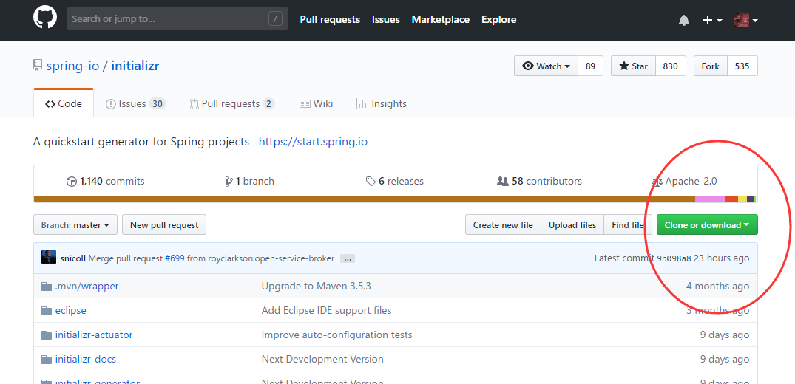
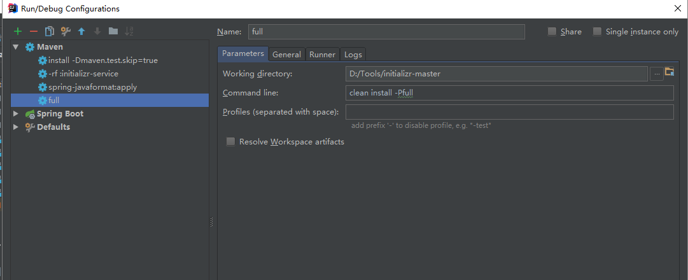
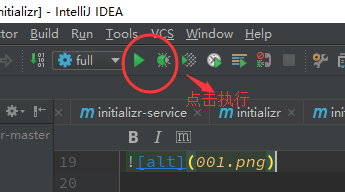
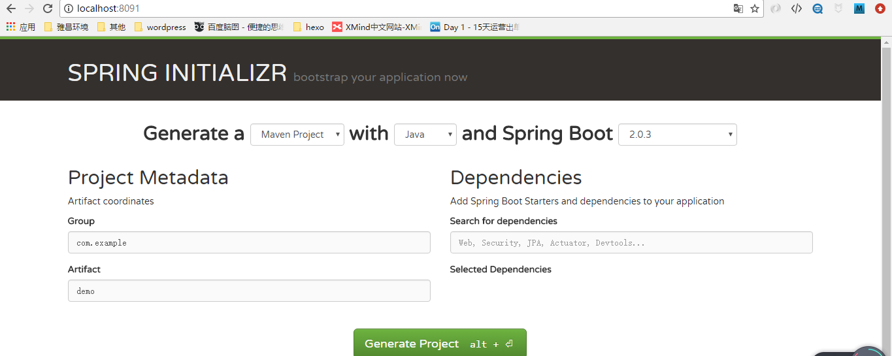
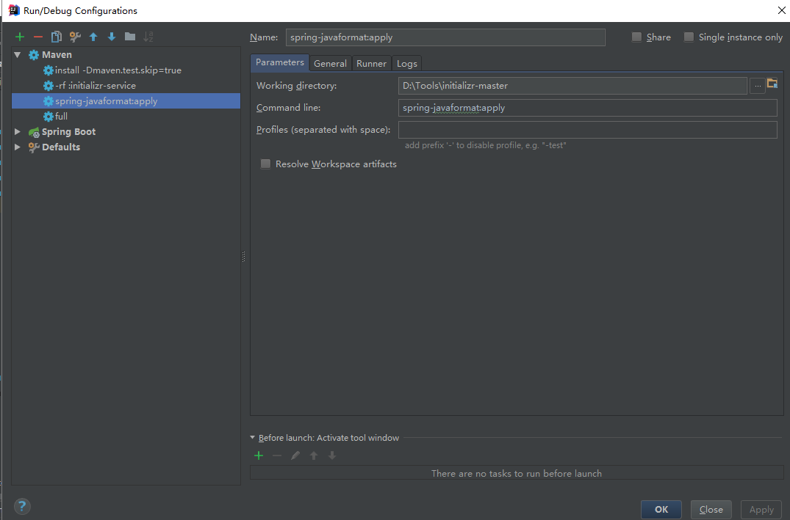

## 使用idea搭建 SpringBoot initializer构建服务器

### 一、前言
由于https://start.spring.io网络不是很稳定，所以采用官网的initializer-master搭建自己的SpringBoot initializer构建服务器服务器

### 二、安装过程

**1.下载项目源码**

git命令或者直接网络访问下载到本机
```
git clone https://github.com/spring-io/initializr.git

或
直接访问https://github.com/spring-io/initializr.git进行下载
```
如图示例：



**2.安装maven(略，参考网络其他教程)**


**3.构建项目**

* windows cmd 构建命令：
``` 
cd D:/Tools/initializer-master/initializr
mvn clean install -Pfull
```

* idea 构建命令：
```
clean install -P full/clean install -Pfull
```
如图：





看到如下输出，就是成功了！！

```
[INFO] Spring Initializr .................................. SUCCESS [  0.370 s]
[INFO] Spring Initializr :: Generator ..................... SUCCESS [  5.238 s]
[INFO] Spring Initializr :: Web ........................... SUCCESS [ 10.677 s]
[INFO] Spring Initializr :: Actuator ...................... SUCCESS [  6.371 s]
[INFO] Spring Initializr :: Docs .......................... SUCCESS [  4.905 s]
[INFO] Spring Initializr :: Service ....................... SUCCESS [ 10.713 s]
[INFO] ------------------------------------------------------------------------
[INFO] BUILD SUCCESS
[INFO] ------------------------------------------------------------------------
[INFO] Total time: 38.489 s
[INFO] Finished at: 2017-08-18T16:43:38+08:00
[INFO] Final Memory: 56M/506M
[INFO] ------------------------------------------------------------------------

```
### 三、安装过程

**将install之后的jar包部署到服务器或者本地，执行如下命令：**

```
java -jar initializr-service-0.4.0.BUILD-SNAPSHOT.jar --server.port=8091

```

**启动后在浏览器输入`lcoalhost:8091`**

如图：


### 四、安装过程遇到的问题

1.
```
[INFO] Reactor Summary:
[INFO] 
[INFO] Spring Initializr .................................. SUCCESS [  3.595 s]
[INFO] Spring Initializr :: Generator ..................... SUCCESS [  4.022 s]
[INFO] Spring Initializr :: Web ........................... SUCCESS [  1.147 s]
[INFO] Spring Initializr :: Actuator ...................... SUCCESS [  0.636 s]
[INFO] Spring Initializr :: Docs .......................... SUCCESS [  0.419 s]
[INFO] Spring Initializr :: Service ....................... FAILURE [  0.209 s]
[INFO] ------------------------------------------------------------------------
[INFO] BUILD FAILURE
[INFO] ------------------------------------------------------------------------

[ERROR] Run `spring-javaformat:apply` to fix.
[ERROR] -> [Help 1]
[ERROR] 
[ERROR] To see the full stack trace of the errors, re-run Maven with the -e switch.
[ERROR] Re-run Maven using the -X switch to enable full debug logging.
[ERROR] 
[ERROR] For more information about the errors and possible solutions, please read the following articles:
[ERROR] [Help 1] http://cwiki.apache.org/confluence/display/MAVEN/MojoFailureException
[ERROR] 
[ERROR] After correcting the problems, you can resume the build with the command
[ERROR]   mvn <goals> -rf :initializr-service

```
根据错误提示执行如下操作：
* windows cmd
```
mvn spring-javaformat:apply
```
* idea 
```
spring-javaformat:apply
```

如图:



2.

```
[INFO] --- git-commit-id-plugin:2.2.3:revision (default) @ initializr-service ---
[INFO] ------------------------------------------------------------------------
[INFO] BUILD FAILURE
[INFO] ------------------------------------------------------------------------
[INFO] Total time: 6.820 s
[INFO] Finished at: 2018-07-19T17:19:41+08:00
[INFO] Final Memory: 32M/275M
[INFO] ------------------------------------------------------------------------
[ERROR] Failed to execute goal pl.project13.maven:git-commit-id-plugin:2.2.3:revision (default) on project initializr-service: .git directory is not found! Please specify a valid [dotGitDirectory] in your pom.xml -> [Help 1]
[ERROR] 
[ERROR] To see the full stack trace of the errors, re-run Maven with the -e switch.
[ERROR] Re-run Maven using the -X switch to enable full debug logging.
[ERROR] 
[ERROR] For more information about the errors and possible solutions, please read the following articles:
[ERROR] [Help 1] http://cwiki.apache.org/confluence/display/MAVEN/MojoExecutionException

```
根据错误提示，解决方式如下：
```
<plugin>
    <groupId>pl.project13.maven</groupId>
    <artifactId>git-commit-id-plugin</artifactId>
    <executions>
        <execution>
            <goals>
                <goal>revision</goal>
            </goals>
        </execution>
    </executions>
    <configuration>
        <dotGitDirectory>${project.basedir}/../.git</dotGitDirectory>
        <dateFormat>yyyy-MM-dd'T'HH:mm:ssZ</dateFormat>
        <generateGitPropertiesFile>true</generateGitPropertiesFile>
        <generateGitPropertiesFilename>
            ${project.build.outputDirectory}/git.properties
        </generateGitPropertiesFilename>
    </configuration>
</plugin>

```
 改为
 
```
<plugin>
    <groupId>pl.project13.maven</groupId>
    <artifactId>git-commit-id-plugin</artifactId>
    <executions>
        <execution>
            <goals>
                <goal>revision</goal>
            </goals>
        </execution>
    </executions>
    
    <configuration>
        <skip>true</skip>
    </configuration>

</plugin>
```
